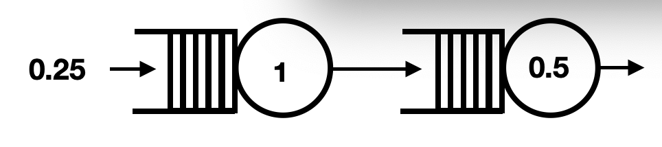

# Systems with multiple queues

The advantage of queuing tool has over the programs for writing queues that you wrote last week is that it can be used to model systems of queues.  In other words, we can use queuing tool to model the two connected queues that are indicated in the following diagram: 



The code in `main.py` provides all the code required to set up and run a simulation of the queue shown in the figure above.  Lets go through this step by step in order to explain how we provide information on the network of queues to queuing tool.  The first thing we need to understand is this command:

```python
adj_list = {0: [1], 1: [2]}
```

This command sets the variable `adj_list` so that it provides information on the way the nodes in a graph are linked together.  The graph we have defined above has three nodes (labelled 0, 1 and 2).  Node 0 is connected to node 1 and node 1 is connected to node two.  The Queue servers that we will define will sit on the edges in this graph.  There will thus be one queue server on the edge between that connects node 0 to node 1 and a second queue server that sits on the edge that connects node 1 to node 2.  We tell queuing tool about the queue servers that are on each edge by defining the variable called `edge_list` as follows:

```python
edge_list = {0: {1: 1}, 1: {2: 2}}
```

This command tells queuing tool that the queue server on the edge that connects node 0 and node 1 is of type 1 and that the queue server on the edge that connects nodes 1 and 2 is of type 2.  These two types of queue server objects are then defined in the following code:

```python
def rate(t) : 
    return 0.25

def arr_f(t):
    return qt.poisson_random_measure(t, rate, 0.25 )

def ser_order(t):
    return t + np.random.exponential(1.0)
    
def ser_tea(t):
    '''time to get order'''
    return t + np.random.exponential(2.0)

q_classes = { 1: qt.QueueServer, 2: qt.QueueServer }
q_args = {
    1: {
        'num_servers': 1,
        'arrival_f': arr_f,
        'serivce_f': ser_order
    },
    2: {
        'num_servers': 1,
        'serivce_f': ser_tea
    },
}
```

Notice how the functions we have written and looked at in previous exercises are used to determine when customers arrive in the queue and how long it takes to server customers.  The only difference is that we now define two queue server objects, which we can refer to using the labels 1 and 2 as we have set the variable `q_classes` above.  The parameters for these two Queue server objects are set in the `q_args` variable.  Notice, furthermore, that no `arrival_f` function is defined for the second queue as agents arrive in this queue when they have finished being served by the first queue server.

Notice finally that the variable `g` that we have always used in the call to `qt.QueueNetwork` is created from the variables `adj_list` and `edge_list` that we defined above by the following command:

```python
g = qt.adjacency2graph(adjacency=adj_list, edge_type=edge_list)
```

This object contains all the information about the graph on which our queues sit.

Look back at the first of the exercises on queuing tool where drew a graph showing the time each the agents spent in the in the queue.  __Your task in this exercise is to write similar code to the code that you wrote in the first exercise to simulate the queue and to determine the total each agent spends between arriving at the first queue and leaving the second queue after being served.__  As in that first exercise you should __plot a graph that shows plot how long each agent spends in the queue system.__  The x-coordinates of the points in your graph should be numerical indices that distinguish each agent.  The x-coordinate of the first point will thus be 1, the x-coordinate of the second point will be 2, the third will be 3 and so on.  The y-coordinates should then tell you how long that particular agent spent in the queue.  In other words, the nth y-coordinate will tell you the amount of time that passed between the arrival of the nth agent into the queuing system and their departure time from it.  

The x-axis of your plot should have the label "Agent" and the y-axis of your plot should have the label "Time spent in system".
 
